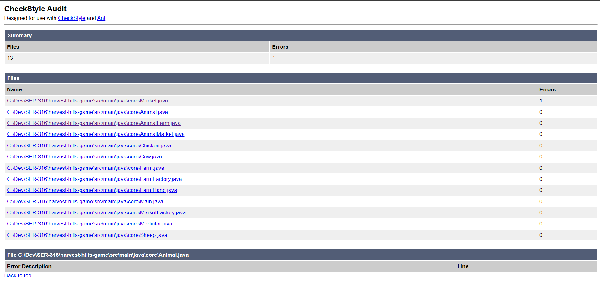
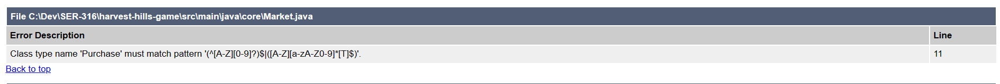
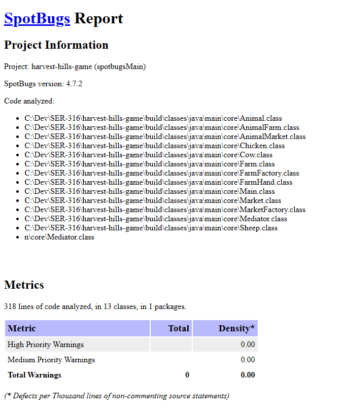
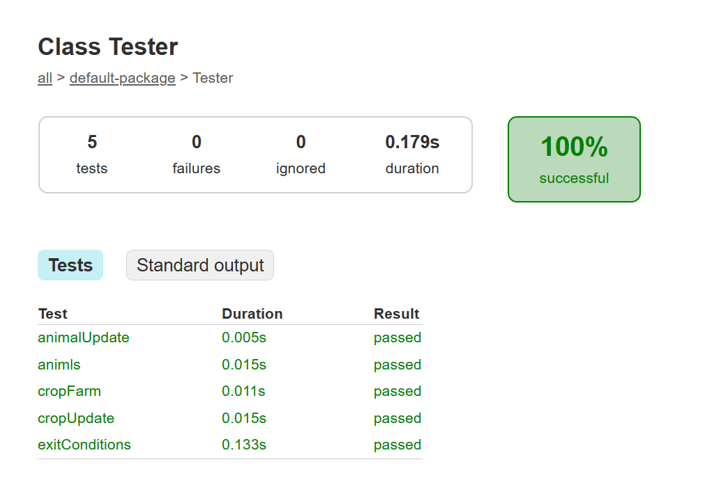

# Harvest Hills Game
This is a game simulation in which a farm is created and crops are grown or animals are reared. The game runs on a cycle-based system, with each cycle consisting of a day and a night.

[Link to screencast](https://github.com/jscottysolomon/harvest-hills-game/blob/main/src/resources/git_example.mp4)

## Running

```
gradle startGame --console=plain
```
*Note: a plain console is not required but is recomended*

## Game Loop

There are two types of farms: anaimal farms and crop farms. In the morning (day) cycle, crop/animals are checked on. Any produce/production is sold. In the night portion of the cycle, the farmer goes to the market, where they can hire farm hands or crops/animals. Financial decisions (when farmhands are hired, if crops/animals are bought each night) occur at random each night. Once the day/night cycle finishes, the farm updates for the next cycle. A check is made for whether exit conditions are met. Crop/animals are also updated an random events (crops/animals dying) are calculated.

## Requirements met
+ New world starts with one farm 
    + Only one farm is ever used at a time
+ Farms are of different types 
    + Crop or animal farms. Which farm the player gets is chosen at random before the simulation begins.
+ Animals reside on farm 
    + If animal farm is chosen
+ Animal produce products every 2 days
    + Animals have the possibility of getting sick, so products are produced after every two days an animal is not sick.
+ Predators during night cycle
    + At the end of the cycle, animals have a random chance of being eat by wolves and crops have a chance of being eaten by rabbits. This happens on a per-crop/animal basis.
+ Aniamls live for 14 days unless they are killed.
    + Animals wont die from sickness, only predators.
    + Sick animals have a high chance of recovery every night cycle
    + Sick animals do not produce animal products
+ Animals have a natural lifecycle
    + Animals cannot produce products for the first two days, but can still get sick or be killed
+ Crops are harvested at the end of every 3 cycles
    + some crops have a shorter/longer time till maturation, but they also have a lower/higher sell/purchase price
+ Animals and crops cost currency
    + Farms have a chance of buying multiple crops/animals during the night (market) portion of the cycle


## Design Patterns

The design patterns are largely entertwined with one another. They were all used to fulfill the above requirments, so it's a little difficult to completely seperate them.

### **Mediator Patter**

The Mediator.java file is used to facilitate the entire game logic and loop. The Mediator requests a farm object (from the farm factory), factiliates the game output, and checks if conditions have been met to end the simulationg.

The farm object also acts as a centralized mediator, which controls the animals/crops and is responsible for updating them and the end of every cycle.

### **Factory Pattern**

The factory pattern is largely used to faciliate the random events of the game. Firstly, the mediator requests a farm from the FarmFactory, and the farm factory makes the decision of which farm type is returned. 

The MarketFactory is used to request a Market object based on the current farm type.

Market objects themselves act as factories. During the night cycle, the Market object randomly generates a list of farmhands the farm purchases and the payrate for each farm hand. Based on the farm type, the Market object also creates a list of animals or crops that the farm will buy, as well as the purchase and sell price of each. (The sell price of animal products is standardized).

### **State Pattern**

The state pattern is used to facilate changes that happen during game cycles.

When animals/crops are updated at the end of the cyle, they have a chance of dying and changing their toString for when they are checked on the next morning. The state pattern is also used to track age updates and sell conditions. 

The farm object updates at the end of every game cycle and creates an endMessage do display to the user if an exit condition is met.

## **Checkstyle**
Below is a summary of my checkstyle report 


I only had one issue. I used a generic type for a farms product (animal or crop), and entitled the generic \<Product>, but I recieved an error when I had it capitalized but also recieved an error when I renamed the generic to \<product> that it should be uppercase, so I just left ther variable as is. See below for a screenshot of the issue.


## **Spotbugs**

I did not leave any issues found by Spotbugs. See below for a screenshot of the report. 



## Unit Tests
Below is a screenshot that shows the results of my unit testing.

